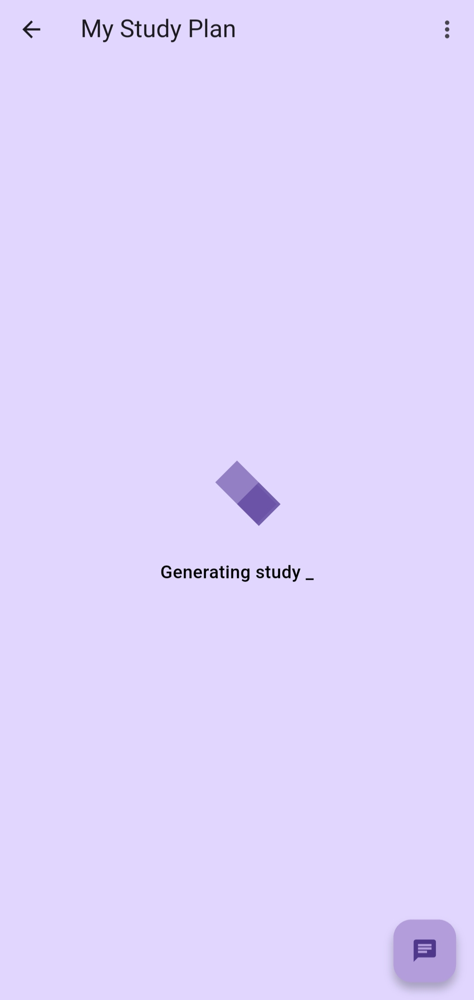
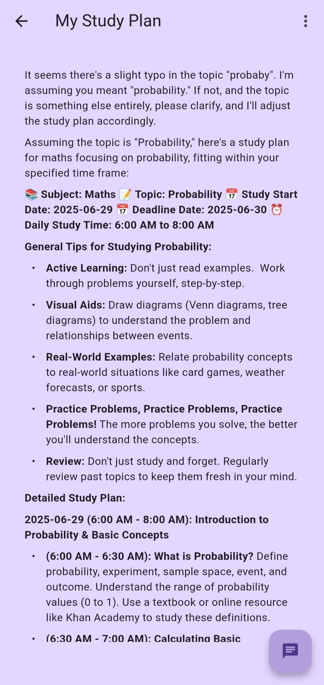
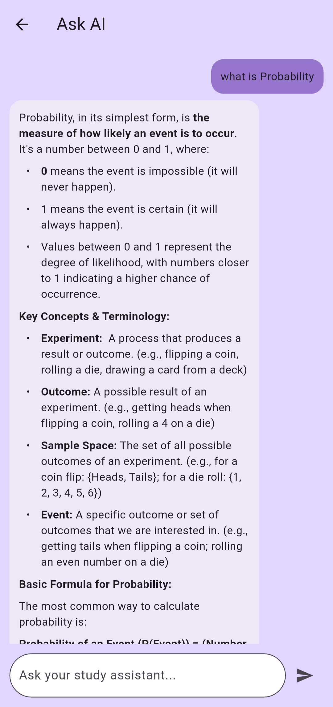
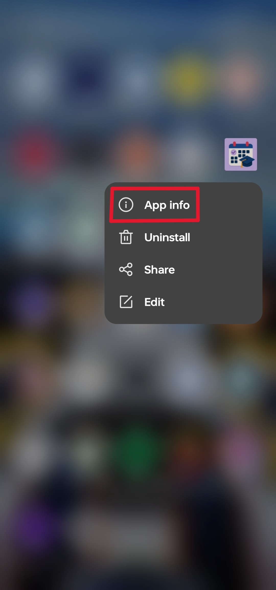
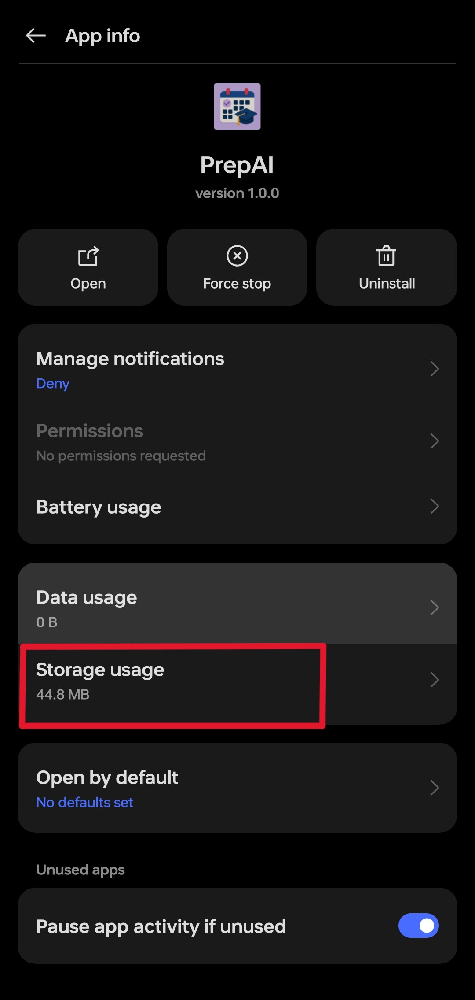
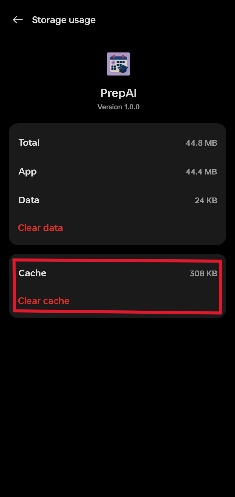

<p align="center">
  
</p>

# Smart Study Planner App

A simple study planner app for those how likes to schedule and create a perfect study plans. By using this app create perfect plans wheneven needed.


## Features🔧

- User-friendly interface
- Easy login and sign-up process
- Save plans
- Rename plans
- AI Chat for your specific plan
- Custom Date and time options

## Screenshots

<p align="center">
  
  
  
  
</p>


## Installation/How to run this app locally on your pc.📲

For someone just want the app on their handheld devices just follow the steps given below.🫵

- ️Download the latest Release on your Mobile phone or Tablet and install it.

Here are some important points to remember while using this app.‼️

- The app uses yours phone storage to save your plans and Login credential.
- Once you created your account the app stays logged in. 
- But if needed you can clear the app's cache which will remove all your saved plans and login credential.

<p align="center">
  
  
  
</p>

## Installing and running on your own pc.💻
Install and use my project on your own pc for making changes or just to have fun.
"Recommended to use android studio with flutter packages."
https://youtu.be/mMeQhLGD-og?feature=shared 👈 refer this yt video for installing flutter with android studio

```
Create an .env file and paste your API key and API url as
API_KEY=AIc............
API_URL=https://generativelan............
```
https://aistudio.google.com/apikey 👈 get your own gemini API key and API url
```
run pub get on your "pubspec.yaml" file to install all dependencies
```    
```
also run this following commands to if flash screen won't work properly

flutter clean
flutter pub get
flutter pub run flutter_native_splash:create
```
It's ready to run.

And I think if you are understanding what ever i have written above, then i guess you know how to run your application on android studio.

If not no worry here is how to do it.
https://youtu.be/oESs0FV1AVg?feature=shared

Of course i won't tell each and every steps. Just watch the video.
## 🛠️ Built With

- [Flutter](https://flutter.dev/)
- [Android Studio](https://developer.android.com/)
- [Google AI Studio](https://aistudio.google.com/)
- [Dart](https://dart.dev/)


## Contributing

Contributions are always welcome!


## Authors

- [linkedin](www.linkedin.com/in/pratik-bairagi)
- [Website](https://my-portfolio-rouge-iota-67.vercel.app/)

